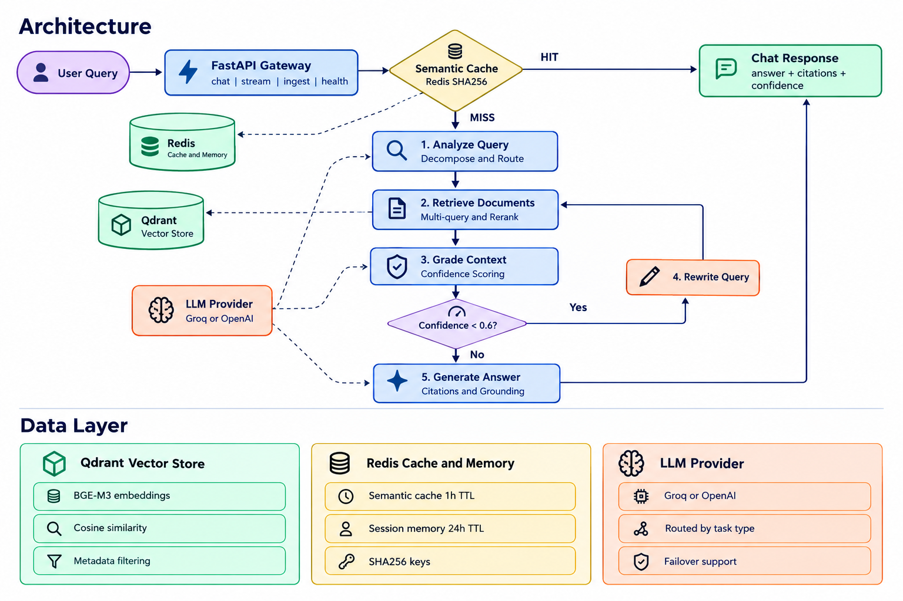

# Agentic RAG

A production-architected Retrieval-Augmented Generation system with self-correcting retrieval loops, cross-encoder reranking, and semantic caching. Built with LangGraph, FastAPI, Qdrant, and Redis.

## Overview

Traditional RAG pipelines retrieve once and generate blindly. When retrieval fails, the LLM hallucinates. Agentic RAG treats retrieval as a reasoning loop: analyze, retrieve, grade, rewrite, generate, with confidence-gated self-correction at every step.

Key capabilities:

- Stateful agent orchestration via LangGraph
- Multi-query decomposition for complex questions
- Cross-encoder reranking for high-precision retrieval
- Semantic caching delivering 90x latency reduction on repeat queries
- Citation-grounded generation with confidence scoring
- Real-time streaming via Server-Sent Events

## Architecture

## Request Lifecycle

Every query flows through an intelligent, self-correcting pipeline.

1. **Cache lookup.** Normalized query hashed with SHA256 and checked in Redis. A cache hit returns in roughly 80 milliseconds.
2. **Query analysis.** The LLM analyzes intent, decides the route (retrieve or direct), and decomposes complex questions into one to four focused sub-queries.
3. **Multi-query retrieval.** Dense retrieval from Qdrant using BGE-M3 embeddings, followed by cross-encoder reranking with BGE-reranker-v2-m3.
4. **Confidence grading.** An LLM grader scores context sufficiency on a scale from 0 to 1.
5. **Self-correction loop.** If confidence drops below 0.6 and retry count is under the maximum, the agent rewrites the query and retries retrieval.
6. **Grounded generation.** The final answer is generated with inline citations traced back to source chunks.

## Performance

Verified via `time curl` against the running endpoint.

| Metric | Value |
|--------|-------|
| Cold query latency | 7 to 14 seconds (CPU inference) |
| Cached query latency | ~80 milliseconds |
| Cache speedup | ~90x |
| Reranker precision | 0.99+ on production queries |
| Streaming events | 5 SSE event types per request |

## Key Features

### Agentic Reasoning
- LangGraph state machine instead of naive sequential chains
- Self-correcting loop that retries with rewritten queries when confidence drops
- Multi-query decomposition of one complex query into focused sub-queries
- Intent routing that distinguishes retrieval from direct-answer paths

### Advanced Retrieval
- Dense vector search using BGE-M3 multilingual embeddings
- Cross-encoder reranking with joint query-document scoring
- Multi-query aggregation with deduplication
- Metadata filtering for scoped retrieval

### Answer Quality
- Citation tracking, every claim traced to a source chunk
- Confidence scoring through a grader LLM
- Hallucination guard that refuses to answer when context is insufficient
- Grounding enforced through prompts

### Production Patterns
- Semantic caching with SHA256 keys and 1 hour TTL
- Session memory backed by Redis with 24 hour TTL
- SSE streaming with node-level progress events
- Structured logging across every agent node
- Health checks with dependency status
- Containerized deployment via Docker Compose

## Technology Stack

| Layer | Technology |
|-------|-----------|
| API | FastAPI + Uvicorn |
| Agent | LangGraph |
| Vector DB | Qdrant |
| Embeddings | BAAI/bge-m3 |
| Reranker | BAAI/bge-reranker-v2-m3 |
| Cache and Memory | Redis 7 |
| LLM | Groq / OpenAI |
| Orchestration | Docker Compose |

## Design Decisions

**Why LangGraph over LangChain Agents.** LangGraph provides explicit state, cyclic graphs, and testable nodes. Every transition is a first-class edge, which matters for debugging and reliability.

**Why cross-encoder reranking.** Dense retrieval optimizes for recall. Cross-encoders optimize for precision by jointly scoring query and document. Combined, we get recall from Qdrant and precision from the reranker. Typical precision gain is 15 to 25 percent over vector-only retrieval.

**Why self-correction.** LLMs hallucinate when retrieval fails. Instead of trusting a single pass, we grade confidence and retry with rewritten queries when the context is weak.

**Why semantic caching.** Production RAG traffic is heavy-tailed. A small set of queries dominates volume. Query-level caching delivers 90x speedup on repeats with 1 hour TTL.

**Why confidence-gated refusal.** It is better to say "I don't know" than to hallucinate. Verified with off-domain queries such as "What is the population of Mars?"

## API Surface

| Method | Endpoint | Description |
|--------|----------|-------------|
| POST | /chat | Sync chat with full pipeline |
| POST | /chat/stream | Server-Sent Events streaming |
| POST | /ingest/file | Upload and index a document |
| GET | /health | Health and indexed docs count |
| GET | /docs | Interactive Swagger UI |

Streaming event contract:

## Roadmap

- API key authentication and rate limiting
- RAGAS evaluation suite
- Hybrid retrieval with BM25 and dense fusion
- Prometheus metrics and Grafana dashboard
- Async graph execution
- GPU inference or API-based embeddings
- Multi-tenant architecture
- Web UI built with Next.js

## Engineering Notes

This project was hardened through 22 production bugs, from LangGraph state management to Pydantic schema mismatches. Each fix is documented in commit history and reflects real-world integration challenges.

Tested edge cases:

- Off-domain query correctly refuses instead of hallucinating
- Complex multi-part query decomposes into 3 sub-queries
- Cache hit path shows 90x speedup verified with `time curl`
- Session memory persists multi-turn conversations in Redis

## License

MIT License. See LICENSE for details.

## Acknowledgments

Built with LangGraph, Qdrant, FastAPI, and open-source embedding models from BAAI.